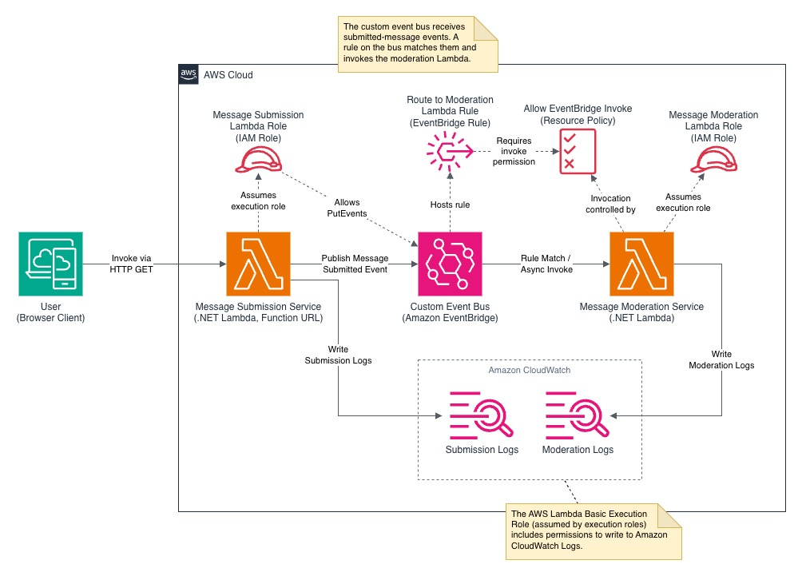

# Manual AWS Infrastructure Provisioning

This guide walks through provisioning the three AWS resources shown in the architecture diagram using the AWS Management Console.



All steps assume you are signed in to the AWS Console and working in a single region.

---

## Prerequisites

- An AWS account with permissions to create Lambda functions, IAM roles, and EventBridge resources.
- The deployment packages already built in the `packages/` folder:
  - `packages/MessageSubmissionLambda/MessageSubmissionLambda.zip`
  - `packages/MessageModerationLambda/MessageModerationLambda.zip`

---

## 1. Create the Custom Event Bus

The default EventBridge bus handles AWS service events. This demo uses a dedicated custom bus so that published messages are isolated from system traffic and can be routed with their own rules.

1. Open the **Amazon EventBridge Console** > **Event buses**.
2. Choose **Create event bus**.
3. Enter the following values:

| Section | Setting | Value |
|---|---|---|
| Event bus details | Name | `message-moderation-bus` |
| Encryption | Encryption type | **Use AWS owned key** (default) |
| Logs | Log destinations | **No log destinations selected** (default) |

4. Choose **Create**.
5. Copy the event bus ARN for later steps.

Example ARN format:

```
arn:aws:events:<region>:<account-id>:event-bus/message-moderation-bus
```

---

## 2. Create IAM Execution Roles

Each Lambda function assumes an IAM execution role that controls which AWS services the function can call at runtime. The publisher needs permission to write events to EventBridge, while the subscriber only needs the default CloudWatch Logs permission. Creating separate roles keeps each function's access scoped to exactly what it requires.

### Publisher Role (MessageSubmissionLambda)

1. Open the **IAM Console** > **Roles** > **Create role**.
2. In **Select trusted entity**, use:

| Setting | Value |
|---|---|
| Trusted entity type | **AWS service** |
| Service or use case | **Lambda** |
| Use case | **Lambda (Default)** |

3. Choose **Next**.
4. In **Add permissions**, attach **AWSLambdaBasicExecutionRole**.
5. Choose **Next**.
6. In **Name, review, and create**, use:

| Setting | Value |
|---|---|
| Role name | `MessageSubmissionLambdaRole` |

7. Choose **Create role**.
8. Open the new role and choose **Add permissions** > **Create inline policy**.
9. Configure the inline policy:

| Setting | Value |
|---|---|
| Service | **EventBridge** |
| Actions allowed | **PutEvents** |
| Resources | **Add ARNs** |
| Resource ARN | Event bus ARN from step 1 |

10. Choose **Add ARNs**, then choose **Next**.
11. In **Review and create**, set policy name to `AllowEventBridgePutEventsPolicy`.
12. Choose **Create policy**.
13. Confirm both policies are attached to the role:
    - `AWSLambdaBasicExecutionRole`
    - `AllowEventBridgePutEventsPolicy`

### Subscriber Role (MessageModerationLambda)

1. Open the **IAM Console** > **Roles** > **Create role**.
2. In **Select trusted entity**, use:

| Setting | Value |
|---|---|
| Trusted entity type | **AWS service** |
| Service or use case | **Lambda** |
| Use case | **Lambda (Default)** |

3. Choose **Next**.
4. In **Add permissions**, attach **AWSLambdaBasicExecutionRole**.
5. Choose **Next**.
6. In **Name, review, and create**, set role name to `MessageModerationLambdaRole`.
7. Choose **Create role**.

No additional inline policy is required for this subscriber role.

---

## 3. Create the Lambda Functions

These are the two .NET 10 Lambda functions that make up the demo. The submission function receives HTTP requests via a Function URL and publishes events to the custom bus. The moderation function subscribes to those events through the EventBridge rule created in the next step.

### MessageSubmissionLambda (Publisher with Function URL)

1. Open the **Lambda Console** > **Functions** > **Create function**.
2. Keep **Author from scratch** selected.
3. In **Basic information**, set:

| Setting | Value |
|---|---|
| Function name | `MessageSubmissionLambda` |
| Runtime | **.NET 10 (C#/F#/PowerShell)** |

4. Expand **Additional settings**.
5. Under **Execution role**, select **Use an existing role**, choose `MessageSubmissionLambdaRole`, and choose **Save**.
6. Under **Function URL**, set auth type to **NONE** and invoke mode to **BUFFERED** (default), then choose **Save**.
7. Choose **Create function**.
8. Copy the generated Function URL for testing.
9. In the **Code** tab, choose **Upload from** > **.zip file**.
10. Select `packages/MessageSubmissionLambda/MessageSubmissionLambda.zip` and choose **Save**.
11. In **Runtime settings**, choose **Edit** and set the handler to:

```
MessageSubmissionLambda::MessageSubmissionLambda.MessageSubmissionFunction::FunctionHandler
```

12. Choose **Save**.
13. Go to **Configuration** > **Environment variables** and choose **Edit**.
14. Add the following variables:

| Key | Value |
|---|---|
| `EVENT_BUS_NAME` | `message-moderation-bus` |
| `EVENT_SOURCE` | `message-submission-service` |
| `EVENT_DETAIL_TYPE` | `MessageSubmitted` |

15. Choose **Save**.

### MessageModerationLambda (Subscriber)

1. Open the **Lambda Console** > **Functions** > **Create function**.
2. Keep **Author from scratch** selected.
3. In **Basic information**, set:

| Setting | Value |
|---|---|
| Function name | `MessageModerationLambda` |
| Runtime | **.NET 10 (C#/F#/PowerShell)** |

4. Expand **Additional settings**.
5. Under **Execution role**, select **Use an existing role**, choose `MessageModerationLambdaRole`, and choose **Save**.
6. Choose **Create function**.
7. In the **Code** tab, choose **Upload from** > **.zip file**.
8. Select `packages/MessageModerationLambda/MessageModerationLambda.zip` and choose **Save**.
9. In **Runtime settings**, choose **Edit** and set the handler to:

```
MessageModerationLambda::MessageModerationLambda.MessageModerationFunction::FunctionHandler
```

10. Choose **Save**.

No environment variables are required for this function.

---

## 4. Create the EventBridge Rule

A rule on the custom bus filters incoming events by source and detail type, then forwards matching events to a target. This rule connects the two Lambda functions: it listens for events published by the submission function and invokes the moderation function with the event payload.

1. Open the **EventBridge Console** > **Rules** > **Create rule**.
2. If **Visual rule builder** is selected, deselect it.
3. In **Define rule detail**, set:

| Setting | Value |
|---|---|
| Name | `route-to-moderation-lambda` |
| Event bus | `message-moderation-bus` |
| Rule state | **Enabled** |

4. Choose **Next**.
5. In **Build event pattern**, choose **Custom pattern (JSON editor)** and enter:

```json
{
  "source": ["message-submission-service"],
  "detail-type": ["MessageSubmitted"]
}
```

6. Choose **Next**.
7. In **Select target(s)**, set:

| Setting | Value |
|---|---|
| Target types | **AWS service** |
| Select a target | **Lambda function** |
| Function | **MessageModerationLambda** |

8. Choose **Next**.
9. In **Configure tags**, choose **Next**.
10. In **Review and create**, choose **Create rule**.
11. Copy the rule ARN for the Lambda permission step.

---

## 5. Verify the Lambda Resource-Based Policy

Execution roles control what a Lambda can call out to. A resource-based policy controls the opposite — what is allowed to invoke the Lambda. The moderation function needs a policy statement granting EventBridge permission to invoke it when the rule fires. This statement should reference the specific rule ARN so that only the intended rule can trigger the function.

1. Open **MessageModerationLambda** in the Lambda Console.
2. Go to **Configuration** > **Permissions**.
3. Under **Resource-based policy statements**, verify the list is empty.
4. Choose **Add permission**.
5. In **Edit policy statement**, set:

| Setting | Value |
|---|---|
| Policy statement type | **AWS service** |
| Service | **EventBridge (CloudWatch Events)** |
| Statement ID | `AllowEventBridgeInvoke` |
| Principal | `events.amazonaws.com` (default) |
| Source ARN | Rule ARN from step 4 |
| Action | `lambda:InvokeFunction` |

6. Choose **Save**.

Rule ARN format:

```
arn:aws:events:<region>:<account-id>:rule/message-moderation-bus/route-to-moderation-lambda
```

Equivalent policy statement:

```json
{
  "Effect": "Allow",
  "Principal": {
    "Service": "events.amazonaws.com"
  },
  "Action": "lambda:InvokeFunction",
  "Resource": "arn:aws:lambda:<region>:<account-id>:function:MessageModerationLambda",
  "Condition": {
    "ArnLike": {
      "AWS:SourceArn": "arn:aws:events:<region>:<account-id>:rule/message-moderation-bus/route-to-moderation-lambda"
    }
  }
}
```

---

## 6. Test the End-to-End Flow

With all resources in place, a browser request to the submission Lambda's Function URL should publish an event, trigger the moderation Lambda through EventBridge, and produce log output in both functions' CloudWatch log groups.

### Baseline Request

1. Start with the base Function URL copied from **MessageSubmissionLambda**:

```
https://<function-url-id>.lambda-url.<region>.on.aws/
```

2. Add a query string parameter:

| Query key | Query value |
|---|---|
| `text` | `hello world` |

3. Example full URL:

```
https://<function-url-id>.lambda-url.<region>.on.aws/?text=hello+world
```

4. Expect a `200` response with: **"Message handed off for moderation."**

### Additional Test Query Values

Use the same base Function URL and change only the `text` query value.

```
gee+golly+I+did+not+expect+that
oh+gosh+drat+I+dropped+my+keys
rats+I+knew+I+should+have+turned+left
aw+shoot+shucks+that+was+my+last+chance
darn+it+dang+the+printer+is+jammed+again
what+the+heck+is+going+on+with+this+frick+thing
oh+fudge+I+left+the+oven+on
crud+the+build+broke+and+everything+is+crap
some+jerk+called+me+an+idiot+at+the+store
get+your+butt+over+here+you+left+poop+on+the+floor
```

Each request should return `200`.

### CloudWatch Verification (After Testing)

1. Open **MessageSubmissionLambda** > **Monitor** > **View CloudWatch logs**.
2. Open **MessageModerationLambda** > **Monitor** > **View CloudWatch logs**.
3. In each log view, clear date/time filters first.
4. Apply filter text `DEMO`.
5. Verify expected log output in both log groups:

| Log group | Expected text |
|---|---|
| `/aws/lambda/MessageSubmissionLambda` | `DEMO \| MESSAGE SUBMISSION` |
| `/aws/lambda/MessageModerationLambda` | `DEMO \| MESSAGE MODERATION` |

6. For flagged test values, confirm moderation logs show `Flagged` with matched terms listed alphabetically.


